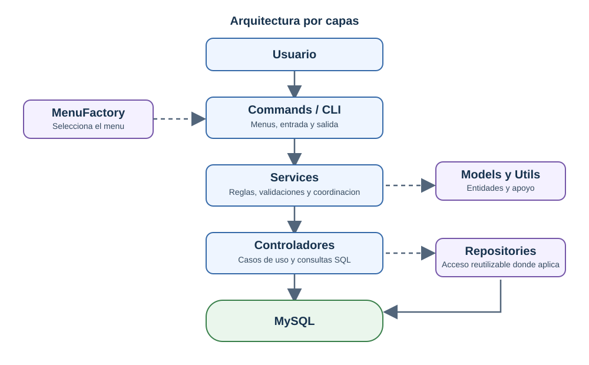
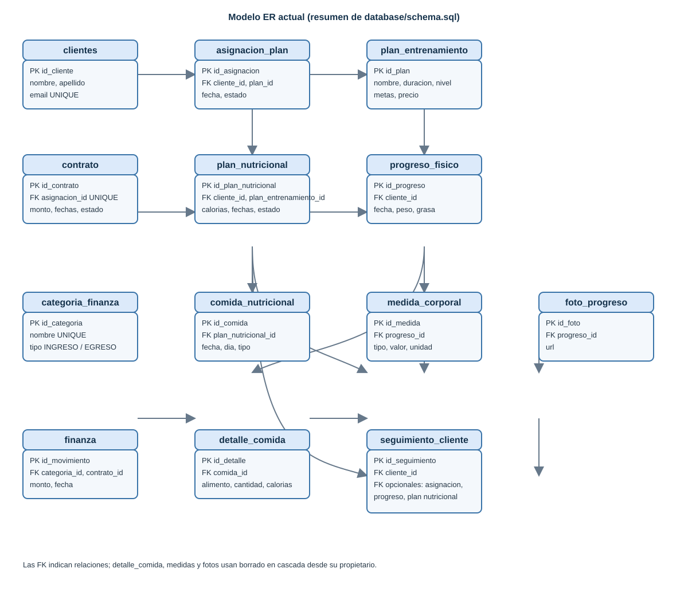
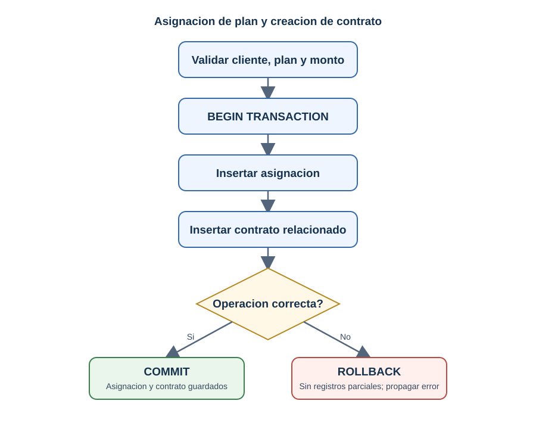

# Sistema de gestión de gimnasio (CLI)

Aplicación de consola desarrollada con Node.js y MySQL para administrar clientes, planes de entrenamiento, asignaciones y contratos, progreso físico, nutrición, finanzas y seguimiento integral.

## Requisitos

- Node.js 20 o posterior y npm.
- MySQL 8.0 o posterior con InnoDB.
- MySQL Workbench es opcional.

## Instalación y ejecución

1. Instala dependencias: `npm install`.
2. Ejecuta `database/schema.sql` en MySQL. El script crea y selecciona `gimnasio_db`.
3. Copia `.env.example` a `.env` y configura tus credenciales. No subas `.env` al repositorio.
4. Opcionalmente, ejecuta `database/seed.sql` para cargar datos de demostración.
5. Verifica la conexión: `npm run db:check`.
6. Inicia la aplicación: `npm start`.

El sistema requiere `DB_HOST`, `DB_USER` y `DB_NAME`. `DB_PASSWORD` puede estar vacío en una instalación local sin contraseña.

| Variable | Requerida | Valor predeterminado | Descripción |
| --- | --- | --- | --- |
| `DB_HOST` | Sí | — | Host de MySQL |
| `DB_USER` | Sí | — | Usuario de MySQL |
| `DB_PASSWORD` | No | vacío | Contraseña de MySQL |
| `DB_NAME` | Sí | — | Nombre de la base de datos |
| `DB_PORT` | No | `3306` | Puerto de MySQL |
| `DB_CONNECTION_LIMIT` | No | `10` | Límite de conexiones del pool |
| `MONEDA` | No | `GTQ` | Código de moneda para mostrar montos |

## Funcionalidades

- Alta y consulta de clientes y planes de entrenamiento.
- Asignación de planes y creación de contratos; renovación, finalización y cancelación.
- Registro e historial de progreso físico, con medidas y fotos.
- Planes nutricionales, comidas, alimentos y reportes por rango de fechas.
- Ingresos y egresos, listado de movimientos y balance con filtros.
- Seguimiento integral con relaciones opcionales a asignaciones, progreso y nutrición.

La CLI solicita identificadores de registros relacionados. Para registrar una comida solicita un JSON con `plan_nutricional_id`, `fecha`, `dia_semana`, `tipo_comida`, `indicaciones` y `alimentos`; este último es un arreglo de objetos con `alimento`, `cantidad`, `unidad` y `calorias_estimadas`.

## Arquitectura

El sistema usa una arquitectura por capas orientada a objetos:



- **Commands (`src/commands`)** presentan menús con Inquirer/Chalk, solicitan datos y muestran resultados. No deberían contener consultas SQL.
- **Services (`src/services`)** validan entradas, aplican reglas de negocio y coordinan operaciones.
- **Controladores (`src/controladores`)** ejecutan SQL parametrizado y operaciones transaccionales.
- **Repositories (`src/repositories`)** encapsulan consultas reutilizables; `ClienteRepository` extiende `BaseRepository` para operaciones de clientes.
- **Models (`src/models`)** representan las entidades del dominio.
- **Config (`src/config`)** carga la configuración y crea el pool MySQL.
- **Factories (`src/factories`)** centraliza la selección del menú mediante `MenuFactory`.
- **Utils (`src/utils`)** reúne validaciones, formato de moneda y errores comunes.

Se usan clases y métodos estáticos donde corresponde. OOP, SOLID y patrones Repository/Factory se aplican de manera pragmática; no todos los módulos usan Repository ni existe una interfaz formal para cada capa.

Las operaciones con varias escrituras relacionadas usan transacciones, como la asignación con contrato, el registro de progreso con medidas/fotos y la comida con sus alimentos. En errores, el controlador revierte la transacción.

## Base de datos

`database/schema.sql` es la fuente de verdad para tablas y relaciones. `database/seed.sql` contiene datos de demostración. Consulta [normalización](database/normalization.md). Si aplicas el esquema a una base existente, respalda y migra primero: `CREATE TABLE IF NOT EXISTS` no modifica tablas que ya existen.

## Documentación del proyecto

- **Backlog del producto:** [docs/backlog.md](docs/backlog.md). Contiene épicas/módulos, prioridad y puntos de historia.
- **Historias de usuario:** [docs/user-stories.md](docs/user-stories.md). Contiene HU-01 a HU-14, criterios de aceptación y SP.
- **Plan de sprints:** [docs/sprint-planning.md](docs/sprint-planning.md).
- **Documentación técnica:** [docs/technical.md](docs/technical.md).
- **Flujo Git y Conventional Commits:** [docs/git-workflow.md](docs/git-workflow.md).
- **Diagramas:** guarda las imágenes en `docs/diagramas/` con estos nombres para que se muestren aquí:

  **Arquitectura del sistema**

  

  **Modelo entidad-relación**

  

  **Flujo de transacciones**

  

  Los SVG incluidos se escalan al ancho del visor sin perder nitidez. Puedes reemplazarlos por tus diagramas manteniendo esos nombres. El esquema ejecutable `database/schema.sql` debe ser la referencia para el diagrama ER.

## Pruebas

Hay pruebas automatizadas en `tests/`. Ejecútalas con `npm test`. Para comprobar solamente la conexión MySQL usa `npm run db:check`.

## Árbol del proyecto y propósito de los archivos

```text
gimnasio_campus_tech/
├── .env.example                     Plantilla de configuración MySQL
├── .gitignore                       Excluye secretos, dependencias y archivos temporales
├── package.json                     Dependencias y comandos npm
├── package-lock.json                Versiones resueltas de dependencias
├── README.md                        Guía principal del proyecto
├── database/
│   ├── schema.sql                   Crea tablas, claves, restricciones e índices
│   ├── seed.sql                     Datos opcionales para demostración
│   ├── normalization.md             Explica formas normales e integridad
│   └── normalizacion_gimnasio.xlsx  Diccionario y análisis de normalización
├── docs/
│   ├── backlog.md                   Backlog del producto
│   ├── user-stories.md              Historias de usuario y criterios
│   ├── sprint-planning.md           Plan de sprints y dependencias
│   ├── technical.md                 Arquitectura, persistencia y transacciones
│   ├── git-workflow.md              Convención de commits y flujo Git
│   └── diagramas/
│       ├── arquitectura.svg          Arquitectura por capas
│       ├── modelo-er.svg             Resumen del esquema MySQL
│       ├── transacciones.svg          Flujo de asignación y contrato
│       └── README.md                 Diagramas Mermaid y referencias
├── src/
│   ├── index.js                     Punto de entrada de la aplicación
│   ├── commands/                    Menús e interacción de consola
│   │   ├── MainMenu.js              Menú principal y navegación
│   │   ├── ClienteMenu.js            Opciones de clientes
│   │   ├── PlanMenu.js               Opciones de planes de entrenamiento
│   │   ├── ContratoMenu.js           Asignaciones y ciclo de vida de contratos
│   │   ├── ProgresoMenu.js           Registro y consulta de progreso físico
│   │   ├── NutricionMenu.js          Planes, comidas y reportes nutricionales
│   │   ├── FinanzaMenu.js            Movimientos y balances financieros
│   │   └── SeguimientoMenu.js        Seguimiento integral del cliente
│   ├── services/                    Validación y reglas de negocio
│   │   ├── ClienteService.js         Casos de uso de clientes
│   │   ├── PlanService.js            Casos de uso de planes
│   │   ├── AsignacionService.js       Asignación y creación asociada de contrato
│   │   ├── ContratoService.js         Renovación, finalización y cancelación
│   │   ├── ProgresoService.js         Gestión de progreso físico
│   │   ├── NutricionService.js        Planes, comidas y reportes nutricionales
│   │   ├── FinanzaService.js          Validación y consultas financieras
│   │   └── SeguimientoService.js      Consultas y registro de seguimiento
│   ├── controladores/               Persistencia y consultas SQL
│   │   ├── BaseController.js          Funciones comunes para controladores
│   │   ├── ClienteController.js        Consultas de clientes
│   │   ├── PlanController.js           Consultas de planes
│   │   ├── AsignacionController.js     Transacción de asignación y contrato
│   │   ├── ContratoController.js       Persistencia del ciclo de contrato
│   │   ├── ProgresoController.js       Persistencia transaccional del progreso
│   │   ├── NutricionController.js      Persistencia de nutrición y alimentos
│   │   ├── FinanzaController.js        Movimientos, filtros y balances
│   │   └── SeguimientoController.js    Persistencia de seguimiento integral
│   ├── repositories/
│   │   ├── BaseRepository.js           Operaciones SQL reutilizables
│   │   └── ClienteRepository.js        Repository para datos de clientes
│   ├── models/                       Clases de entidades del dominio
│   │   ├── Cliente.js                 Entidad Cliente
│   │   ├── PlanEntrenamiento.js        Entidad PlanEntrenamiento
│   │   ├── AsignacionPlan.js           Entidad AsignacionPlan
│   │   ├── Contrato.js                Entidad Contrato
│   │   ├── ProgresoFisico.js           Entidad ProgresoFisico
│   │   ├── SeguimientoCliente.js       Entidad SeguimientoCliente
│   │   ├── PlanNutricional.js          Entidad PlanNutricional
│   │   ├── ComidaNutricional.js        Entidad ComidaNutricional
│   │   ├── DetalleComida.js            Entidad DetalleComida
│   │   ├── CategoriaFinanza.js         Entidad CategoriaFinanza
│   │   └── Finanza.js                 Entidad Finanza
│   ├── config/
│   │   ├── db.js                      Carga variables y configura el pool MySQL
│   │   └── db-check.js                Comprueba la conexión configurada
│   ├── factories/
│   │   └── MenuFactory.js             Devuelve el menú solicitado
│   └── utils/
│       ├── validators.js              Validaciones compartidas
│       ├── formatters.js              Formato de moneda y presentación
│       └── errors.js                  Errores comunes de la aplicación
└── tests/                            Pruebas automatizadas (node:test)
    ├── cliente.test.js                Pruebas del módulo de clientes
    ├── plan.test.js                   Pruebas de planes
    ├── contrato.test.js               Pruebas de contratos
    ├── seguimiento.test.js             Pruebas de seguimiento
    ├── finanza.test.js                 Pruebas financieras
    └── transacciones.test.js           Pruebas de operaciones transaccionales
```

## Entrega académica

La planificación describe el trabajo previsto; completa responsables, fechas y evidencias con información. El PDF, las evidencias Scrum y el video demostrativo en el siguiente enlace de google drive

https://drive.google.com/drive/folders/1EHoH4rAuWTKglPZUkQhkboBwUMvu51vb?usp=sharing


