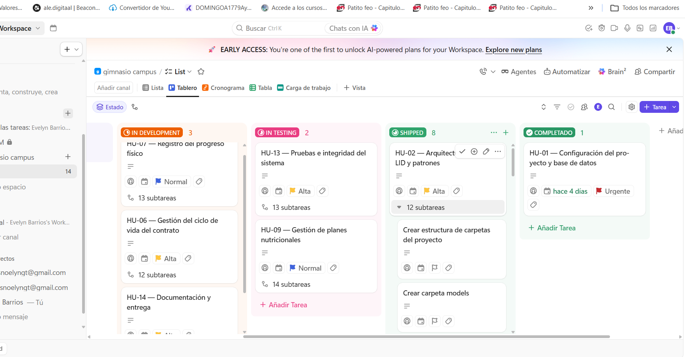
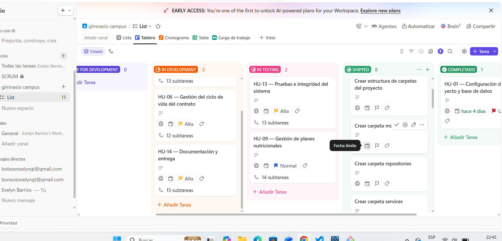

## PRODUCT BACKLOG
## autor Evelyn Barrios

# PRODUCT BACKLOG

## 

| ID | Épica / Módulo | Descripción | Prioridad | SP |
| --- | --- | --- | --- | --- |
| EP-01 | Arquitectura y Base de Datos | Inicialización del proyecto Node.js, conexión a MySQL mediante variables de entorno, OOP y base para transacciones. | Alta | 5 |
| EP-02 | Arquitectura y Patrones | Arquitectura por capas, principios SOLID y patrones Repository y Factory. | Alta | 5 |
| EP-03 | Gestión de Clientes | CRUD de clientes, validaciones e integridad de datos. | Alta | 5 |
| EP-04 | Planes de Entrenamiento | Creación y gestión de planes con nombre, duración, metas físicas, nivel y precio. | Alta | 5 |
| EP-05 | Asignación y Contratos | Asociación de clientes con planes y generación automática de contratos mediante transacciones. | Alta | 8 |
| EP-06 | Gestión de Contratos | Renovación, finalización y cancelación de contratos, manteniendo la consistencia de los datos relacionados. | Alta | 8 |
| EP-07 | Progreso Físico | Registro semanal del progreso físico y mantenimiento del historial cronológico. | Media | 5 |
| EP-08 | Seguimiento Integral del Cliente | Tabla central para relacionar el cliente con asignaciones, progreso físico, nutrición y demás registros necesarios para su seguimiento. | Alta | 5 |
| EP-09 | Nutrición | Creación y gestión de planes nutricionales asociados al cliente y al plan de entrenamiento. | Media | 5 |
| EP-10 | Alimentación y Reportes | Registro de alimentos por día y generación de reportes nutricionales semanales. | Media | 5 |
| EP-11 | Finanzas | Registro de ingresos y egresos del gimnasio. | Alta | 8 |
| EP-12 | Reportes Financieros y Transacciones | Balances por fecha/cliente, consultas de agregación y transacciones para operaciones críticas. | Alta | 8 |
| EP-13 | Pruebas e Integridad | Pruebas de CRUD, relaciones, restricciones, COMMIT, ROLLBACK y operaciones críticas. | Alta | 5 |
| EP-14 | Documentación y Entrega | README, documentación técnica, Scrum, PDF, Conventional Commits y video demostrativo. | Alta | 5 |

**Total: 82 Story Points**

## EVIDENCIA DE PRODUCT BACKLOG 

