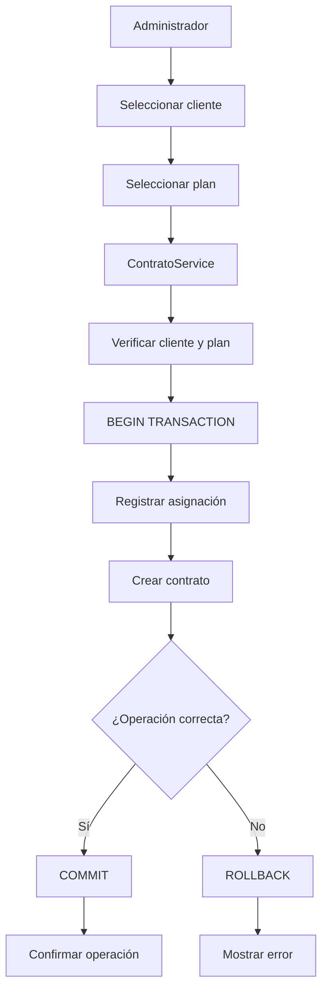
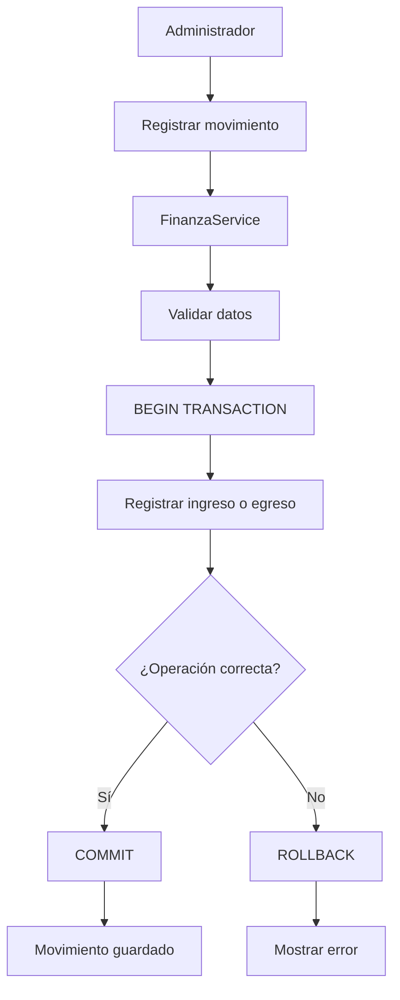
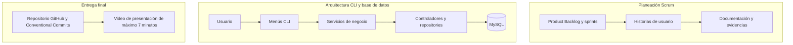
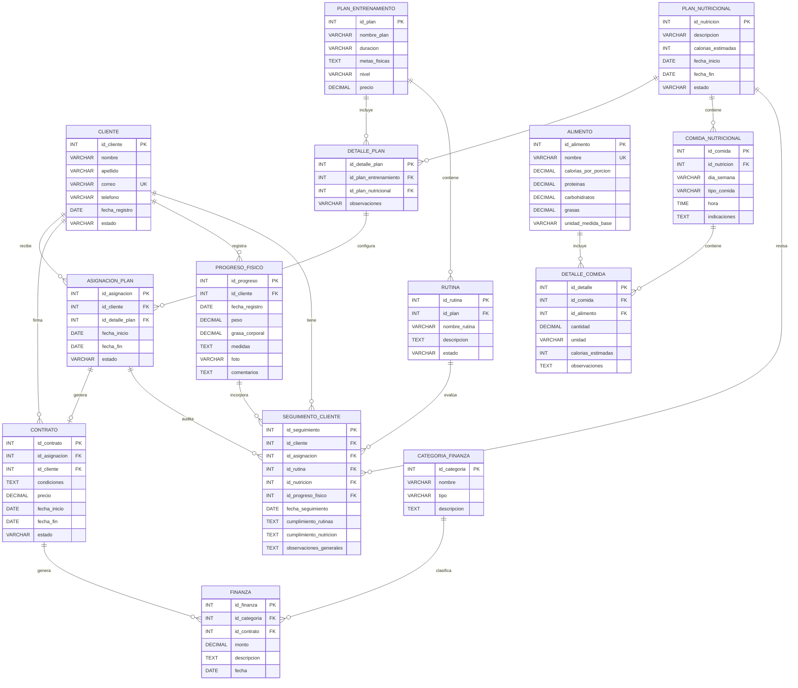

# Diagramas del sistema

En esta página se muestran los flujos principales del proyecto. Cada diagrama está en su propio bloque Mermaid; el visor debe tener Mermaid habilitado para dibujarlos.

## Asignación de plan y contrato

## Registro de movimiento financiero

## Flujo general de trabajo y arquitectura

en el siguiente enlace esta la grabacion del video explicativo
https://drive.google.com/drive/folders/1EHoH4rAuWTKglPZUkQhkboBwUMvu51vb?usp=sharing

