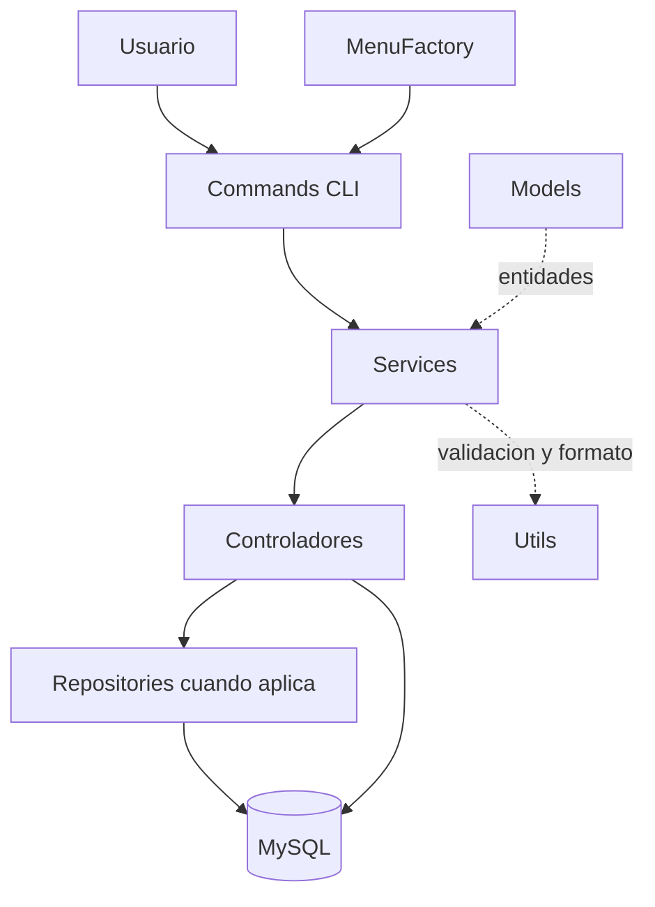

# Documentación técnica

## Componentes y flujo

El proyecto es un CLI Node.js con módulos ES (`package.json` declara `type: module`). `src/index.js` inicia `MainMenu`; `MenuFactory` devuelve el menú elegido. Los menús llaman a servicios, que validan entradas y delegan en controladores. Los controladores ejecutan SQL parametrizado mediante `mysql2/promise`; `src/config/db.js` crea un pool y carga variables desde `.env`.

```text
Usuario → commands → services → controladores → MySQL
                         ↘ utils
Factory → selección del menú
Models → representación de entidades
```



Los controladores contienen consultas y coordinación de persistencia. `ClienteRepository` y `BaseRepository` muestran el patrón Repository para el CRUD de clientes. `MenuFactory` implementa una Factory sencilla para seleccionar menús. Los modelos encapsulan datos de dominio. SOLID y OOP se emplean de manera pragmática: no todos los módulos dependen de interfaces ni todas las consultas usan Repository.

## Persistencia e integridad

### Correspondencia con el diagrama ER entregado

El diagrama ER recibido no coincide completamente con el esquema ejecutable actual. En el diagrama aparecen `RUTINA`, `ALIMENTO` y `DETALLE_PLAN`; estas tablas no existen en `database/schema.sql`. El esquema actual usa `plan_entrenamiento`, `asignacion_plan`, `contrato`, `plan_nutricional`, `comida_nutricional`, `detalle_comida`, `progreso_fisico`, `medida_corporal`, `foto_progreso`, `seguimiento_cliente`, `categoria_finanza` y `finanza`. Los alimentos se almacenan como texto en `detalle_comida`, no en una tabla `alimento`. Tambien cambian nombres de columnas y relaciones.

Para la entrega, actualiza el diagrama ER desde `database/schema.sql` y presenta ese archivo como fuente de verdad. El diagrama de arquitectura conceptual puede acompañar el proyecto si refleja el flujo de capas documentado arriba.

El esquema se crea con `database/schema.sql` en MySQL 8. Las claves foráneas protegen las relaciones. Clientes, contratos y movimientos usan restricciones de borrado; detalles pertenecientes a comidas/progreso se eliminan en cascada y las referencias opcionales de seguimiento pasan a `NULL` al desaparecer su entidad relacionada. Consulta `database/normalization.md` para el resumen 1FN, 2FN y 3FN.

Las credenciales se leen en `src/config/db.js`. La conexión no se abre hasta que un controlador solicita una consulta; `npm run db:check` verifica conectividad. La aplicación falla al importar la configuración si falta `DB_HOST`, `DB_USER` o `DB_NAME`.

## Operaciones transaccionales

- La asignación de un plan y la creación de su contrato se confirman o revierten juntas.
- Cambios de estado y renovaciones de contrato usan transacción.
- El registro del progreso y sus medidas/fotos se guarda como una sola unidad.
- Una comida y sus detalles de alimentos se guardan como una sola unidad.
- El registro financiero valida la categoría y guarda el movimiento dentro de una transacción.

En caso de error, los controladores ejecutan `ROLLBACK`, propagan el error y liberan la conexión. El pool se cierra al terminar `db:check`.

## Pruebas

El comando `npm test` ejecuta archivos `tests/*.test.js` con `node --test`. Las pruebas que usan la base de datos requieren que el esquema y la configuración de prueba estén disponibles; `src/config/db-check.js` es un comprobador de conexión y no configura ni crea por sí mismo una base de pruebas aislada. Evita ejecutar las pruebas contra una base con información importante.

## Alcance funcional comprobado en el código

Los menús ofrecen consultas y altas de clientes/planes; no exponen todas las acciones CRUD descritas en algunas historias. Por tanto, no se debe presentar el CRUD completo de todos los módulos como disponible desde la CLI. El módulo financiero registra y lista movimientos y consulta balances; el reporte nutricional recibe rango de fechas, que puede abarcar una semana. La capa de finanzas permite asociar un contrato cuando aplica.

Para cambios de esquema, actualiza `database/schema.sql` y revisa las restricciones antes de aplicarlos sobre una base existente. `CREATE TABLE IF NOT EXISTS` crea tablas faltantes, pero no migra una tabla ya creada.
